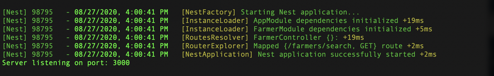

# Farmer POC Project

## About
This project is composed by:
- WebService: A node.js REST API responsible to search farmers.
- WebApp: The web site allows users to search Farmers by doc# or by the farmer name, it consumes the server.

### Project folder structure
- `/server`: a webservice that uses [Nest.js](https://nestjs.com/), a powerfull framework on top of Express. 
- `/wepapp`: a SPA built-in [Angular 7](https://angular.io/) front-end app.


# Installing locally

Please checkout this repository in your local env.:

```
git clone https://github.com/lucasmendonca/farmers-poc.git
```
Note: For both projects please make sure that you are running with Node.js version > 11.x;

## WebService

### Running 
In local enviroment install the dependencies:
- `cd server`
- `npm install`

and build the project:
- `npm run start`

The server should start listening at `http://localhost:3000`.



#### Example of how to consume the web-server
Example of request:

```cmd
curl -X GET \
  'http://localhost:3000/farmers/search?key=lucas' \
  -H 'cache-control: no-cache'
```

Response:

```json
[
    {
        "address": {
            "address": "Rua Paraguai 79 30340740",
            "country": "Brasil",
            "state": "MG",
            "street": "Rua Paraguai"
        },
        "document": {
            "documentNumber": "475.122.829-00",
            "documentType": "rg"
        },
        "id": "1abc",
        "name": "Lucas Mendonca"
    }
]
```

The webservice is using mocked data. Please consult the [mocked-data](server/src/constants/mocked-farmers.ts) to see available values.

### Automated tests
To check automated tests, please run:
- `npm run test`  (for unit-tests)
- `npm run test:e2e` (for e2e tests)


## Webapp
### Running 
In local enviroment install the dependencies:
- `cd webapp`
- `npm install`

then build the project:
- `npm run start`

Open your browser and navigate to `http://localhost:4200`.

### How to use:
Search for a Name/Document Number, then click on the right side arrow. The app will search for the Name/Doc# and fill other fields in case a Farmer is found.

    NOTE: please make sure the WebService is running at `http://localhost:3000`.


## Automated tests
To check automated tests, please run:
- `npm run test`  (for unit-tests)

## Copyright/Contact
Lucas Mendonça (lucasnix@gmail.com).

